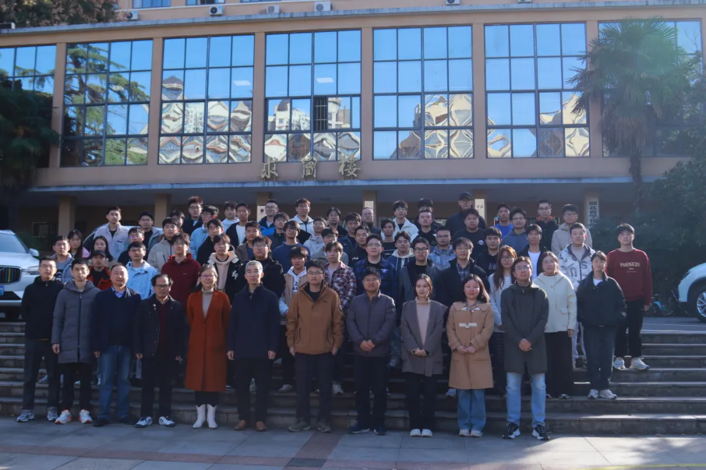
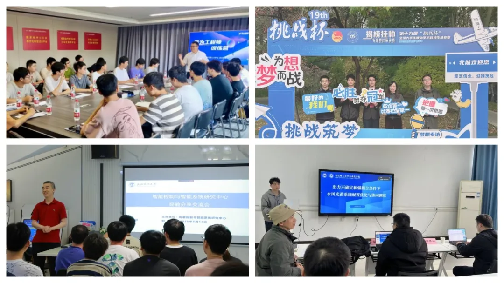
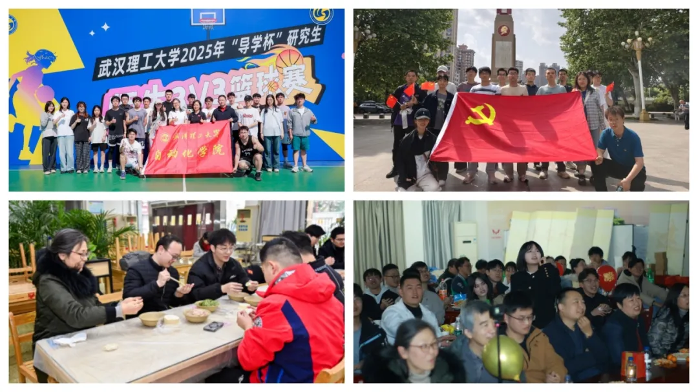

<section style="display: inline-block; width: auto; vertical-align: top; align-self: flex-start; flex: 0 0 auto; border-style: solid; border-width: 1px; border-color: rgb(16, 140, 215); border-radius: 12px; overflow: hidden; padding: 6px 5px; min-width: 5%; max-width: 100%; height: auto; box-shadow: rgb(33, 141, 221) 6px 6px 0px 0px; margin: 0px 6px 0px 0px; box-sizing: border-box; visibility: visible;">
<section style="text-align: center; box-sizing: border-box; visibility: visible;">

<strong style="box-sizing: border-box; visibility: visible;">
智能驱动跨域攻关 &nbsp;德技并修人文润心
</strong>

</section>
</section>

智能控制与智能系统研究中心导学团队以习近平新时代中国特色社会主义思想为指导，秉承“博雅、求真、立人”核心理念，坚守“四个统一”育人准则，构建“党建引领+科研赋能+协同育人+人文关怀”四位一体建设模式，创新多层级协同培养机制与“研本共建”科创梯队，将思想政治教育与学术科研深度融合，着力培养具有“家国情怀、创新精神、国际视野”的高层次技术人才，为国家战略领域与行业高质量发展提供坚实支撑。

    

        一、团队建设
    

<figure style="margin-bottom:10px;">  </figure>

智能控制与智能系统研究中心导学团队成立于2005年，立足学科发展前沿，研究方向包括系统优化与智能控制、机器学习、智慧船舶、智慧交通、新型配电网、储能系统等领域，先后承担横向项目100余项、纵向项目20余项（含国家自然科学基金项目、工信部高技术船舶专项等），研究覆盖国防军工、智慧电力、智慧城市、智慧交通、智慧医疗、气象预警、防灾减灾、可再生能源利用等领域。团队秉承着“博雅、求真、立人”的理念，将科研与育人紧密结合，努力培养具有“家国情怀、创新精神、国际视野”的高层次优秀人才。

团队由苏义鑫教授领衔，现有教授6人，副教授8人，中级职称1人；在读研究生总人数146人（硕士生132人、博士生14人），已毕业研究生472人（硕士生456人、博士生16人）。

1. “四好”建设目标

在师德师风引领上，坚守教师职业道德规范，发挥党员先锋模范作用，打造“为人师表、潜心育人”的导师队伍；在育人模式创新上，深化多层级协同培养与党建育人融合机制，构建跨学科、重实践的培养体系；在团队文化塑造上，营造“团结协作、科研报国、追求卓越”的学术氛围，兼顾学生专业成长与身心健康；在成果业绩突破上，聚焦国家关键核心技术领域，实现科研创新与人才培养协同提升，推动学科发展与行业需求精准对接，助力学生成长为行业中坚力量。

2. 重点建设任务

<strong>深化党建引领育人实效。</strong>拓展“师生结对・支部共建”范围，创新理论学习与实践研学融合模式。

<strong>强化科创梯队建设。</strong>完善“研本共学共进”机制，重点突破学科竞赛与科研转化瓶颈。

<strong>推进产学研深度融合。</strong>拓展与重点企业、科研院所的合作平台，新增技术攻关项目与实习基地。

<strong>筑牢学术道德防线。</strong>构建全流程学术诚信监督体系，提升人才培养质量与社会认可度。

    

        二、特色做法
    

本团队以“党建为魂、科研为基、育人为本”为核心，创新形成“三维驱动、多层协同、全域覆盖”的建设模式，将特色做法贯穿育人全过程，凸显差异化优势与可推广价值。 

1. 党建引领三维育人 筑牢家国情怀根基

以党支部为战斗堡垒，通过“理论研学、实践践学、学创互促”三维发力，将思想政治教育融入科研与成长各环节，培养学生“科研报国”的责任担当。

依托自动化学院研究生第四党支部，建立“师生同学、实践研学、学创循环”常态化机制。向内邀请学术带头人解读国家战略需求，向外与校内外党支部开展共建联学，组织党员参与中船重工、国家电网等重点企业研学全覆盖；结合AI技术创编特色党课，形成“学习-实践-创作-传播”闭环。每学期开展“科研报国・研途有我”主题党日活动，组织聆听时代楷模张连钢报告会，邀请企业精英与学术带头人分享行业报国实例；创编的廉洁微网课《“尽小者大，慎微者著”》在央视网展播，《从“爱达・魔都”看中国智造的创新密码》成为学院精品党课。支部获批学校首批研究生样板党支部，党员服务时长年人均达40小时；该模式实现思政教育与专业特色结合，已在学院多个导学团队推广借鉴。

2. 多层级协同培养机制 精准赋能学术成长

针对研究生差异化发展需求，构建“大组会交流、小组会攻坚、一对一导学”三级体系，实现学术指导全覆盖、个性化、精细化。

课题组大组会聚焦进展汇报与跨方向交流，研究方向小组会针对理论难点与实验技巧开展专题攻坚，导师一对一面谈定制学术规划与职业建议。新生入学即开展“博硕本差异”“治学方法”专题谈话，依据基础提供文献支持与前沿跟踪。针对科研入门研究生，通过小组会拆解“为什么做、做什么、怎么做”核心问题；为高年级研究生搭建学术交流平台，一年来“博学科普讲堂”开展专题报告5人次，多人参与国家级课题研究。近三年指导省级优秀学位论文4篇、校级优秀学位论文28篇，研究生发表高水平学术论文80余篇（SCI/EI收录60余篇），申请专利20余项；该机制适配不同层次研究生培养需求，可复制于理工科导学团队。

3. “研本共建”科创梯队 贯通创新人才培养链

发挥研究生科研优势，联动本科生班级构建“启蒙-培养-竞赛-成长”全链条科创培养体系，实现资源共享、互助共进。

与6个研究生班级、4个本科生班级长期结对，组建机器人大赛、电工电子设计等兴趣小组，通过赛事宣讲、技术帮扶、联合组队等方式，开展科创辅导活动60余场。指导本科生自动化2005班实现省部级以上获奖率100%，保研率39.47%；结对班级累计斩获国家级奖项11项、省部级奖项31项、校级奖项62项，获评“校标兵班集体”等荣誉12项；该梯队模式打通本研培养壁垒，已成为学校科创育人特色品牌。

4. 学术道德与人文关怀并重 护航全面发展

团队坚持“严管厚爱”结合，既强化学术规范与安全管理，又关注学生身心健康与个性化需求，营造和谐导学氛围。

通过组会、座谈会常态化宣讲学术诚信，将实验室安全与学术规范纳入个人考核；导师深入学生一线，建立困难帮扶机制，组织多样化团队建设活动，鼓励学生参与志愿服务与文体活动。针对学业压力较大的学生，导师一对一制定学习计划并协调资源支持；组织“科研+文体”融合活动，团队涌现出中国大学生自强之星、校优秀共产党员等先进个人10余人。团队无学术不端事件，学生心理健康水平持续提升，毕业生满意度高；该管理模式实现“规范与温度”统一，为导学团队文化建设提供参考。

<figure style="margin-bottom:10px;">  </figure>

    

        三、建设成效
    

<strong>科研创新成果方面。</strong>团队聚焦国家战略领域，承担国家自然科学基金、工信部高技术船舶专项等纵向项目20余项，横向合作项目100余项，研究覆盖国防军工、智慧电力等多个关键领域；近三年发表高水平学术论文80余篇（其中SCI/EI收录60余篇），申请国家发明专利20余项，部分成果已应用于防灾减灾、可再生能源利用等场景，获得省部级以上科技奖励5项，为行业提质增效提供技术支撑，产生显著社会与经济效益。

<strong>育人成效表现方面。</strong>支部获批学校首批研究生样板党支部，2名成员获评校优秀共产党员，多人获“校优秀共青团员”“三好研究生”等荣誉；创新竞赛方面，近三年斩获省部级以上奖项70余项，获奖率超50%，其中国家级总冠军2项；就业质量方面，72.4%的毕业生进入三大行业、22.3%赴基层单位，多人入职国家电网、华为、中国船舶集团等世界五百强或战略新兴行业，部分毕业生走上领导岗位；社会实践方面，累计开展志愿服务超5000小时，相关事迹被全国高校思政网、湖北日报客户端等媒体推介。

<strong>产学研结合成果方面。</strong>导师团队深度参与产学研合作，与国家电网、中国船舶、中核集团等企业共建技术研发平台，开展横向项目100余项，为企业提供技术服务与解决方案；搭建实习实践基地多个，每年输送数十名研究生参与企业技术攻关，为学生提供学术交流与就业对接机会，实现“科研项目—实习实践—就业入职”无缝衔接。

团队建设经验多次在学院、学校交流分享，“党建引领+科创赋能”模式被多个导学团队借鉴；结对班级获“校标兵班集体”“五四红旗团支部”等荣誉，研究生班级自研2102班、本科生班级自动化2005班成为学校班风学风建设典型案例；相关育人成果与特色做法被媒体报道，为高校理工科导学团队建设提供实践样本。

    

        四、未来规划
    

未来3年，团队将围绕“提质增效、创新突破、辐射引领”目标，实施四大提升计划。
师德师风提升计划：常态化开展师德专题学习，培育“四有”好老师队伍。育人质量提升计划：优化多层级协同培养机制，新增跨学科课程3-5门，力争省级优秀学位论文数量翻倍。科研创新提升计划：聚焦智慧船舶、新型配电网等前沿领域，新增国家级项目5-8项，推动3-5项成果转化。团队文化提升计划：深化“研本共建”与人文关怀，拓展国际学术交流渠道，培育具有国际视野的创新人才。重点开展跨校跨企业合作平台建设、科创竞赛孵化基地打造、学术诚信教育体系完善等工作，力争建成国内有影响力的研究生导学示范团队，为学科发展与国家科技进步持续贡献力量。
<figure style="margin-bottom:10px;">  </figure>

 供稿：自动化学院  排版：谢思豪  责编：张琴、张蔚  审核：田仕、吕睿 
 
